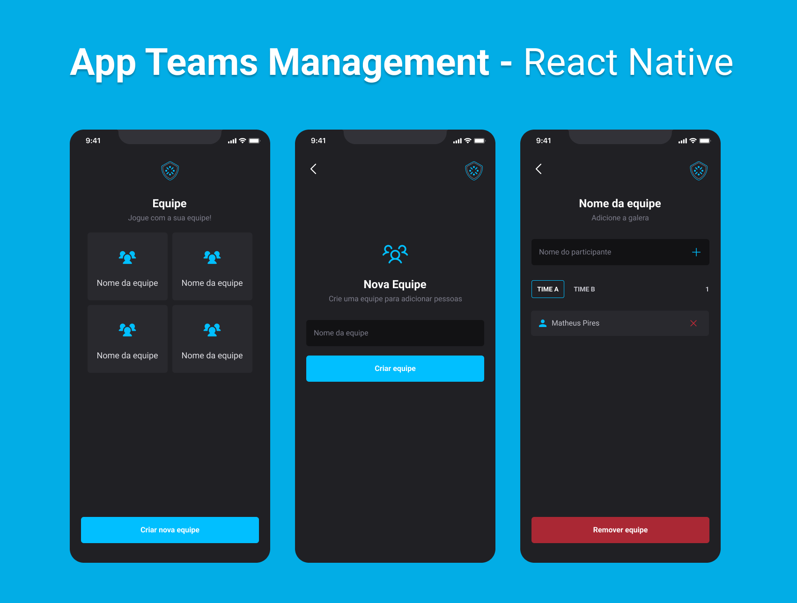

# Teams Management - React Native

Este projeto é uma aplicação de controle de equipes desenvolvida com React Native que foi desenvolvida junto ao módulo Interfaces, Navegação e Armazenamento local da formação React Native da Rocketseat.

## Funcionalidades
A aplicação possui as seguintes funcionalidades:

- Criar uma nova equipe
- Adicionar times dentro das equipes
- Adicionar e remover os participantes de dentro dos times criados
- Remover a equipe

- O aplicativo faz verificações para garantir que não existam participantes repetidos em suas equipes, e também os armazena localmente no aparelho utilizando AsyncStorage.

## Tecnologias Utilizadas
- React Native: Framework para desenvolvimento de aplicativos móveis.
- React: Biblioteca JavaScript para a criação de interfaces de usuário.
- Expo: Ferramenta e plataforma para React Native.

## Screenshots do App

